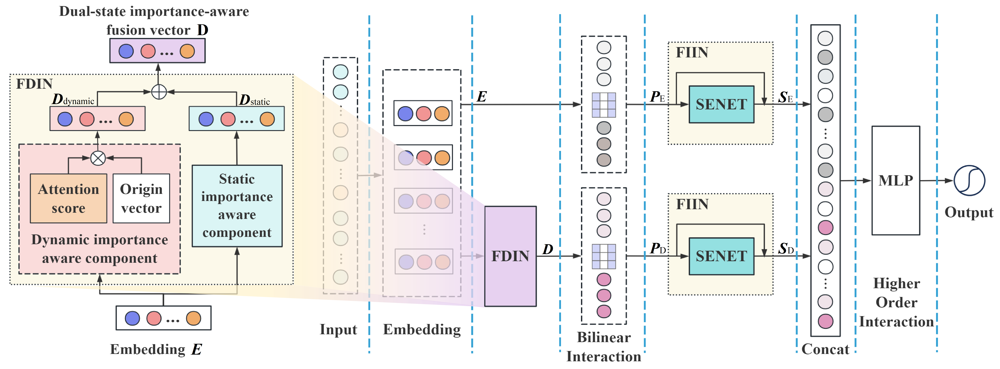

# Dual-state Feature Importance Perception and Adaptive Interaction Importance Modeling for CTR Prediction

## Abstract
Click-through rate (CTR) prediction presents a fundamental challenge in modern recommender systems, where marginal improvements in prediction accuracy can yield substantial economic returns. While existing deep learning approaches demonstrate promising performance, two critical limitations persist: (1) insufficient representation of feature importance in complex recommendation scenarios, and (2) excessive focus on the manner of feature interactions while neglecting the importance of the interactions. To address these challenges, we propose the Feature Dual-state Importance and Interaction Importance Network (FDIIIN), establishing a novel paradigm for feature representation learning and interaction importance modeling. Our model introduces a dual-state feature perception mechanism that concurrently captures static intrinsic importance and dynamic contextual importance through a parallel structure. Furthermore, we develop a dynamic learning architecture employing channel-wise attention operations with residual connections, enabling efficient computation of interaction importance across high-dimensional feature spaces. Additionally, to optimize model performance and efficiency, we introduce a weight-sharing mechanism in FDIIIN, reducing model complexity while maintaining prediction accuracy. Extensive experiments conducted on three public datasets demonstrate the superiority of the proposed method, achieving competitive performance compared to state-of-the-art baselines. A feature-level comparative analysis demonstrates that the dual-state modeling approach significantly contributes to the overall performance improvement, outperforming other perception methods, such as the conventional multi-head self-attention mechanism.

## Model Overview

The core of the FDIIIN model consists of three key modules: FDIN, Bilinear Interaction Layer, and FIIN. FDIN captures the Dual-state importance of features, the Bilinear Interaction Layer performs pairwise feature interactions, and FIIN dynamically assesses the importance of these interactions. Therefore, FDIIIN captures importance at both the feature level and the interaction level to enhance the model's perception ability, improving the performance of CTR prediction.

## Code Availability

We are currently undergoing peer review. The complete codebase will be released upon acceptance of the paper.

At this stage, we provide the implementation of the proposed model. Additional details (e.g., training scripts, data processing, and experiments) will be made available after acceptance.
